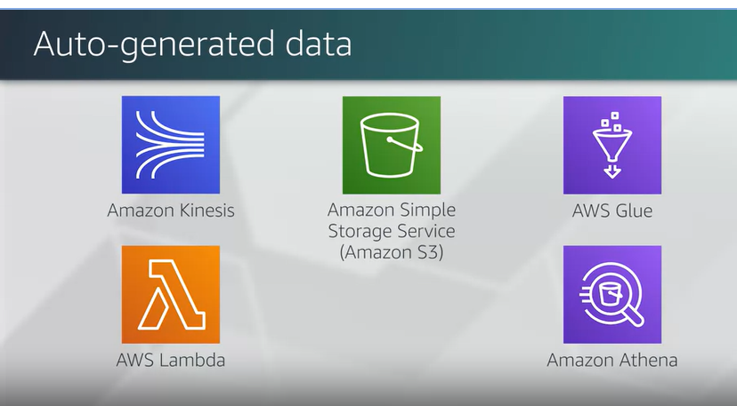
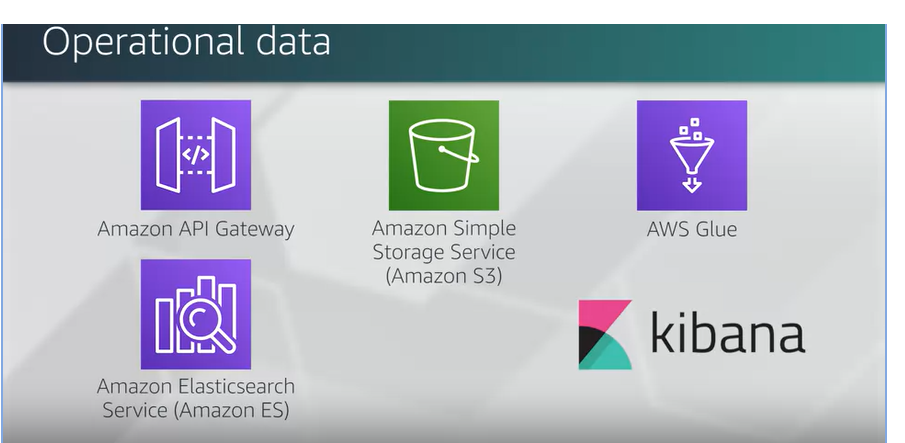
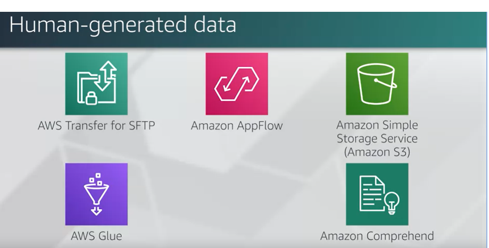

# data_lake_notes
## references
TBD

## Datalake on AWS

### Right tools for the right job
If you have streaming data (coming from IOT device), then following architecture might be suitable

You may also have operational data, such inventory and sales, expense reports, and other inputs. Those likely come in batches and are usually consumed by people who wants to visualize graphs and have access to statistics. This data may be suitable for being ingested with API Gateway, stored in S3, catalogs with Glue, transported to Amazon Elasticsearch Service and visualized with Kibana.

In addition to that, you may want to have human-generated data, such as social media feeds, contact forms, call center audio, e-mails, etc. For these, you may think about access patterns needed by Data Analysis Services
 You could ingest that data with S3, SFTP or Upflow, store it in S3, catalog with Glue and use a service like Amazon Comprehend, which is a natural language processing service that uses machine learning to find insights in texts, such as sentimental analysis
 
## Datalake on AWS - ends

